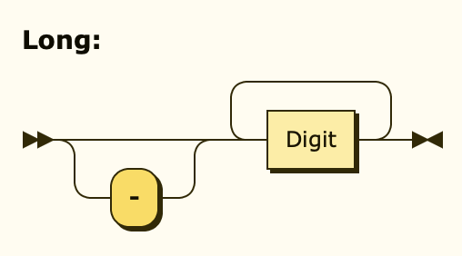
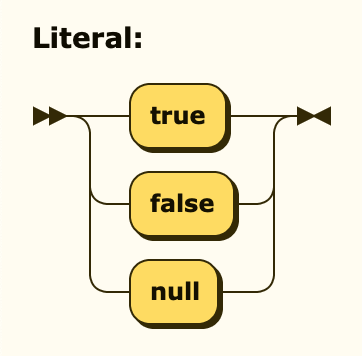
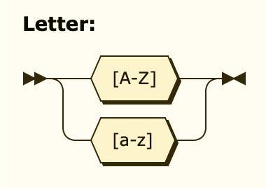

# GPEEE


The opensource `General Purpose Environment Expression Evaluator` which you most definitely
want to integrate into your next project. It's pronounced "cheapy", matching it's slim technical
cost when comparing against a project without `GPEEE`.

## Table of Contents
- [Current State](#current-state)
- [Mission Statement](#mission-statement)
- [How It Works](#how-it-works)
  - [Evaluator API](#evaluator-api)
  - [The Evaluation Environment](#the-evaluation-environment)
  - [Expression Values](#expression-values)
  - [Resolving Variables](#resolving-variables)
  - [Calling Functions](#calling-functions)
  - [Callback Functions](#callback-functions)
  - [Terminal Values](#terminal-values)
- [Grammar](#grammar)
  - [Numbers](#numbers)
  - [Strings](#strings)
  - [Literals](#literals)
  - [Identifiers](#identifiers)
  - [Operators And Precedences](#operators-and-precedences)
  - [Parentheses](#parentheses)
  - [Function Invocation](#function-invocation)
  - [Complete Definition](#complete-definition)

## Current State

The project is still far from being production-ready, but here you can have a look at the most impressive thing it
can accomplish so far:

<details>
  <summary>Click Me</summary>

  Expression:

  ```
  "my prefix: " & iter_cat(my_items, (it, ind) -> "(" & ind & " -> " & it & ")", "|", "no items available")
  ```

  Result:

  ```
  my prefix: (0 -> 1)|(1 -> 3)|(2 -> 5)|(3 -> 21)|(4 -> 49)
  ```

  Environment:

  ```java
  IEvaluationEnvironment env = new IEvaluationEnvironment() {

    @Override
    public Map<String, FExpressionFunction> getFunctions() {
      // iter_cat(items, (it, ind) -> (..), "separator", "no items fallback")
      return Map.of(
        "iter_cat", args -> {
          // Not enough arguments provided
          if (args.size() < 3)
            return ExpressionValue.NULL;

          @Nullable FExpressionFunction formatter = args.get(1).asFunction();

          // Needs to provide a function as the mapper parameter
          if (formatter == null)
            return ExpressionValue.NULL;

          List<ExpressionValue> items = args.get(0).interpretAsList();
          String separator = args.get(2).interpretAsString();

          // Loop all items
          StringBuilder result = new StringBuilder();
          for (int i = 0; i < items.size(); i++) {
            result.append(i == 0 ? "" : separator).append(
              formatter
                .apply(List.of(items.get(i), ExpressionValue.fromInteger(i)))
                .interpretAsString()
            );
          }

          // No items available but a fallback string has been supplied
          if (items.size() == 0 && args.size() >= 4)
            return ExpressionValue.fromString(args.get(3).interpretAsString());

          // Respond with the built-up result
          return ExpressionValue.fromString(result.toString());
        }
      );
    }

    @Override
    public Map<String, Supplier<ExpressionValue>> getLiveVariables() {
      return Map.of();
    }

    @Override
    public Map<String, ExpressionValue> getStaticVariables() {
      Map<String, ExpressionValue> vars = new HashMap<>();

      vars.put("my_items", ExpressionValue.fromListAutoWrap(List.of(
        1, 3, 5, 21, 49
      )));

      vars.put("no_items", ExpressionValue.EMPTY_LIST);

      return vars;
    }
  };
  ```
</details>

## Mission Statement

While this *is* a general purpose evaluator, it has been designed to solve a very specific problem
many bukkit plugin developers face: Allowing the user to easily describe dynamic and possibly complex
behavior inside a *YAML* configuration file. Many successful projects offer such a feature, but - at least
to my knowledge - they all painstakingly implement their own evaluator. Not only does this suck for
the end user who has to learn a million different flavors for basic operation expressions, but it also
heavily constrains lots of plugin developers who don't know how to write a parser in the user experience
of their software.

In order to keep this already pretty complex project as dead simple as possible, I've set a few
main guidelines in stone:

* Very clean, maintainable and well documented codebase to make it accessible for everyone
* Implement all generally known operators but **don't** add anything fancy
* Expressions will **not** keep any state (no variable declarations, etc)
* Next to basic terminal values and operators there will be **no** keywords
* **All** control flow and complex logic will be outsourced to Java and hidden behind functions

Without adhering to these, I'm sure the project would grow into an unmaintainable beast of "one more
feature please". The restrictions may seem harsh, but you're still able to get up and running with
all customizations by defining your own *evaluation environment* exactly to your needs in no time.

## How It Works

The working principle of this evaluator is as simple as it gets: You provide an *evaluation environment*
as well as a string containing the target expression and the evaluator returns an *evaluation result* or
throws an error to be properly handled by the caller.

### Evaluator API

```java
public interface IExpressionEvaluator {

  /**
   * Parses an input string into an abstract syntax tree (AST) to be evaluated
   * later on and possibly be reused for multiple evaluations with multiple environments.
   * @param input Input to parse
   * @return Root node of the AST
   * @throws AEvaluatorError Error during the parsing process
   */
  AExpression parseString(String input) throws AEvaluatorError;

  /**
   * Evaluates a previously parsed expression within a provided evaluation environment.
   * @param expression Expression to evaluate
   * @return Resulting expression value
   * @throws AEvaluatorError Error during the interpretation process
   */
  Object evaluateExpression(AExpression expression, IEvaluationEnvironment environment) throws AEvaluatorError;

}
```

This interface is implemented by the `GPEEE` class, which can be quickly instantiated with an optional debug logger:

```java
public GPEEE(@Nullable Consumer<String> debugLogger);
```

The `debugLogger` will get called with many internal debug messages which can help you to understand how the inner workings
of this state machine operate. In production, it's advised to keep this value at `null`.

### The Evaluation Environment

An *evaluation environment* consists of the following properties:

```java
public interface IEvaluationEnvironment {

  /**
   * Mapping identifiers to available functions which an expression may invoke
   */
  Map<String, FExpressionFunction> getFunctions();

  /**
   * Mapping identifiers to available live variables which an expression may resolve
   */
  Map<String, Supplier<Object>> getLiveVariables();

  /**
   * Mapping identifiers to available static variables which an expression may resolve
   */
  Map<String, Object> getStaticVariables();

  /**
   * Get the value interpreter used to interpret values when doing any kind of
   * operation on them which they'd usually not support naturally. Provide null
   * in order to use the standard interpreter.
   */
  @Nullable IValueInterpreter getValueInterpreter();

}
```

An `identifier` is basically a unique name which can be used inside of expressions and underlies these
[constraints](#identifiers). The only difference between live variables and static variables is that a
live variable will be resolved by calling the supplier function while a static variable has to be set
in stone ahead of time.

An *expression function* can be easily created by adhering to the following signature:

```java
@FunctionalInterface
public interface FExpressionFunction {

  /**
   * Called whenever a function call to the registered corresponding
   * identifier is performed within an expression
   * @param args Arguments supplied by the invocation
   * @return Return value of this function
   */
  Object apply(List<Object> args);

}
```

### Expression Values

Expressions interface with the world around them using the Java Object. All operations can be - by design - performed on
all types, as the Interpreter makes use of a so-called `IValueInterpreter`, provided by the `IEvaluationEnvironment`.
This object decides which value corresponds to an object in different situations. In general, this value can be left as
`null`, since the standard implementation already very likely does what you'd think is intuitive.

The following tables are an overview of standard value interpretation:

**Math operations:**

| LHS    | Operator    | RHS    | Result Type | Notes                     |
|--------|-------------|--------|-------------|---------------------------|
| Long   | +,-,*,^,%   | Long   | Long        | /                         |
| Long   | /           | Long   | Long/Double | Double only on remainders |
| Double | +,-,*,/,^,% | Long   | Double      | /                         |
| Double | +,-,*,/,^,% | Double | Double      | /                         |

Since equality- as well as comparison operations take place mostly on numbers only, all other values have number
fallback values assigned to them:

| Type            | Fallback | Notes              |
|-----------------|----------|--------------------|
| STRING (empty)  | 0        | An empty string    |
| STRING          | 1        | A non-empty string |
| BOOLEAN (true)  | 1        | /                  |
| BOOLEAN (false) | 0        | /                  |
| NULL            | 0        | /                  |
| FUNCTION        | 1        | /                  |
| LIST (empty)    | 0        | An empty list      |
| LIST            | 1        | A non-empty list   |

**Equality operations:**

The non-exact operators (`==`, `!=`) match, if the content of two values is/isn't the same. This also means that
a string containing a number's sequence of characters will equal (`==`) to that number. If the type is also to be
checked, the use of exact operators (`===`, `!==`) is required.

Lists are equal if either their reference is equal or all of their elements are equal (strict or not depends on
the used operator on the lists).

For Strings, non-exact means ignore casing as well as leading/trailing spaces when comparing while exact checks these properties.

**Comparison operations:**

Comparison can only either take place on numbers or on values implementing the `Comparable` interface which are of same type.
In all other instances, both sides of the operator will be interpreted as longs.

**Boolean operations:**

Null values are considered to equal to `false` while all other values only equal true if they compare positively against
zero (> 0). For non-numeric values this means that the fallback of interpreting them as a long will be made use of.

**Concatenation operation:**

Operands of a concatenation operation will always be interpreted as a string and just added together.

### Resolving Variables

A variable is resolved as soon as you write out an `identifier` that's available in the current environment.

### Calling Functions

You should have a look at the exact [grammar](#function-invocation) of a function invocation. Summary: Provide an identifier,
open a parenthesis, specify 0-n parameters (which can be expressions too) and close the parenthesis again. Something like this:
`myFunction("hello world", 1, .3, null, true, false)`.

### Callback Functions

You should have a look at the exact [grammar](#callback-function) of a callback function. Summary: Open a parenthesis,
specify 0-n parameters, close the parenthesis again, write an arrow operator and follow that up by an expression. Something like this:
`foreach(items, (index) -> "index=" & index, "\n")`.

### Terminal Values

Terminal values are immediate values which do not resolve any further and are set in stone from the
point of writing them within the expression onwards.

| Type    | Example                                    |
|---------|--------------------------------------------|
| Long    | 1, -1                                      |
| Double  | .1, -.1, 3.1415                            |
| String  | "Escaped \\" double- and \s single quote " |
| Boolean | true, false                                |
| Null    | null                                       |

## Grammar

All railroad diagrams have been created using [rr](https://bottlecaps.de/rr/ui).

### Numbers

There are two types of numbers, floating point as well as whole numbers.

We start out by defining what a single digit has to look like:

```ebnf
Digit ::= [0-9]
```


Multiple digits in combination with an optional, leading minus sign compose a long.

```ebnf
Long ::= "-"? Digit+
```


If the number contains a decimal, it's a double. It may omit the zero right before the dot.

```ebnf
Double ::= "-"? Digit* "." Digit+
```


### Strings

A string is always surrounded by two double-quotes `"` and may only contain characters other than
double-quotes. To add a double-quote character without closing the string, it has to be escaped `\"`.
Since YAML strings can be cumbersome when it comes to single-quotes, `\s` will be replaced by a single-quote `'`.

```ebnf
String ::= '"' ('\"' | [^"] | "\s")* '"'
```


### Literals

A literal is a fixed value represented by a human-readable word. These words are reserved and cannot be used as identifiers.

```ebnf
Literal ::= "true" | "false" | "null"
```



### Identifiers

An identifier is either a function name, a variable name or a lookup table name. These names are provided by the
evaluation context, may only start with letters and can only consist of letters, digits and underscores.

```ebnf
Letter ::= [A-Za-z]
Identifier ::= Letter (Digit | Letter | '_')*
```



### Operators And Precedences

In order to not have to call functions for simple operations and to improve on readability,
some of the most used operators have been implemented. Operators are listed top to bottom, in descending precedence.

| Operator                    | Example | Description                                          | Precedence |
|-----------------------------|---------|------------------------------------------------------|------------|
| (...)                       | (5 + 3) | Parentheses have the highest possible precedence     | 0          |
| **Negation Operator**       |
| not                         | not A   | Yields the inverse of A                              | 1          |
| **Exponentiation Operator** |
| ^                           | A ^ B   | Yields A to the power of B                           | 2          |
| **Multiplicative Operator** |
| *                           | A * B   | Yields the product of A and B                        | 3          |
| /                           | A / B   | Yields the quotient of A and B                       | 3          |
| %                           | A % B   | Yields the remainder of dividing A by B              | 3          |
| **Additive Operator**       |
| +                           | A + B   | Yields the sum of A and B                            | 4          |
| -                           | A - B   | Yields the difference of A and B                     | 4          |
| **Comparison Operator**     |
| \>                          | A \> B  | Yields `true` if A is greater than B                 | 5          |
| <                           | A < B   | Yields `true` if A is less than B                    | 5          |
| \>=                         | A \>= B | Yields `true` if A is greater than or equal to B     | 5          |
| <=                          | A <= B  | Yields `true` if A is less than or equal to B        | 5          |
| **Equality Operator**       |
| ==                          | A == B  | Yields `true` if A and B equal ignoring casing       | 6          |
| ===                         | A === B | Yields `true` if A and B equal exactly               | 6          |
| !=                          | A != B  | Yields `true` if A and B don't equal ignoring casing | 6          |
| !==                         | A !== B | Yields `true` if A and B don't equal exactly         | 6          |
| **Conjunction Operator**    |
| and                         | A and B | Yields `true` if both A and B yield `true`           | 7          |
| **Disjunction Operator**    |
| or                          | A or B  | Yields `true` if either A or B yields `true`         | 8          |
| **Concatenation Operator**  |
| &                           | A & B   | Concatenates the contents of A and B                 | 9          |

### Parentheses

To enforce a desired order of operations, expressions may be wrapped in parentheses. There is no limit for how many
parentheses the input can contain, they just need to be balanced (every opening parenthesis has to be closed later
down the expression again). While `5 + 2 * 5` would produce 15, `(5 + 2) * 5` will yield 35.

The expression within parentheses can be modified by prepending an operator right before it. The following operators
are available as parenthesis modifiers:

| Operator | Example      | Description                                         |
|----------|--------------|-----------------------------------------------------|
| -        | -(1 + 2)     | Flips the sign of the parentheses expression result |
| not      | not (a && b) | Inverts the boolean parentheses expression result   |


### Function Invocation

Functions are provided by the evaluation context and arbitrarily many may be called an arbitrary amount of times within
the expression. Prepending the invocation with a minus sign will flip the function return value's sign. An invocation is defined like this:

```ebnf
FunctionInvocationExpression ::= "-"? Identifier "(" (Expression | (Expression ("," Expression)*))? ")"
```


### Callback Function

A callback function is an expression which can be programmatically evaluated within a Java function which has been invoked by an
expression. This way, a back and forth type data flow becomes possible.

Callbacks may have an arbitrary amount of parameters which then at runtime become available within the expression
noted after the arrow operator.

```ebnf
CallbackExpression ::= "(" (Identifier | (Identifier ("," Identifier)*))? ")" "->" Expression
```


### Complete Definition

The following [EBNF](https://www.w3.org/2001/06/blindfold/grammar) defines the whole grammar which this parser understands:

```ebnf
Digit ::= [0-9]
Letter ::= [A-Za-z]

Long ::= "-"? Digit+
Double ::= "-"? Digit* "." Digit+
String ::= '"' ('\"' | [^"] | "\s")* '"'
Identifier ::= Letter (Digit | Letter | '_')*
Literal ::= "true" | "false" | "null"

AdditiveOperator ::= "+" | "-"
MultiplicativeOperator ::= "*" | "/" | "%"
EqualityOperator ::= "==" | "!=" | "===" | "!=="
ComparisonOperator ::= ">" | "<" | ">=" | "<="

PrimaryExpression ::= Long | Double | String | Identifier | Literal
NegationExpression ::= "not"? PrimaryExpression
ExponentiationExpression ::= NegationExpression ("^" NegationExpression)*
MultiplicativeExpression ::= ExponentiationExpression (MultiplicativeOperator ExponentiationExpression)*
AdditiveExpression ::= MultiplicativeExpression (AdditiveOperator MultiplicativeExpression)*
ComparisonExpression ::= AdditiveExpression (ComparisonOperator AdditiveExpression)*
EqualityExpression ::= ComparisonExpression (EqualityOperator ComparisonExpression)*
ConjunctionExpression ::= EqualityExpression ("and" EqualityExpression)*
DisjunctionExpression ::= ConjunctionExpression ("or" ConjunctionExpression)*
ConcatenationExpression ::= DisjunctionExpression ("&" DisjunctionExpression)*

Expression ::= ConcatenationExpression | ("-" | "not")? "(" Expression ")"

FunctionInvocationExpression ::= "-"? Identifier "(" (Expression | (Expression ("," Expression)*))? ")"
CallbackExpression ::= "(" (Identifier | (Identifier ("," Identifier)*))? ")" "->" Expression
```
