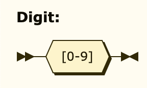
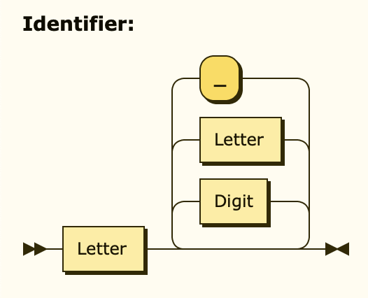

# MinimalParser

## Grammar

### Numbers

There are two types of numbers, floating point as well as whole integers.

We start out by defining what a single digit has to look like:

```ebnf
Digit ::= [0-9]
```



Multiple digits in combination with an optional, leading minus sign compose an integer.

```ebnf
Integer ::= "-"? Digit+
```


If the number contains a decimal, it's a float. It may omit the zero right before the dot.

```ebnf
Float ::= "-"? Digit* "." Digit+
```


### Strings

A string is always surrounded by two double-quotes `"` and may only contain characters other than
double-quotes. To add a double-quote character without closing the string, it has to be escaped `\"`.
Since YAML strings can be cumbersome when it comes to single-quotes, `\s` will be replaced by a single-quote `'`.

```ebnf
String ::= '"' ('\"' | [^"] | "\s")* '"'
```


### Identifiers

An identifier is either a function name, a variable name or a lookup table name. These names are provided by the
evaluation context, may only start with letters and can only consist of letters, digits and underscores.

```ebnf
Letter ::= [A-Za-z]
Identifier ::= Letter (Digit | Letter | '_')*
```




### Operators

In order to not have to call functions for simple operations and to improve on readability,
some of the most used operators have been implemented:

```ebnf
BinaryOperator ::= ">" | "<" | ">=" | "<=" | "&" | "&&" | "||" | "==" | "===" | "+" | "-" | "*" | "/" | "^"
UnaryOperator ::= "!"
```


| Operator     | Example          | Description                                      |
|--------------|------------------|--------------------------------------------------|
| \>           | A \> B           | Yields `true` if A is greater than B             |
| \>=          | A \>= B          | Yields `true` if A is greater than or equal to B |
| <=           | A <= B           | Yields `true` if A is less than or equal to B    |
| +            | A + B            | Yields the sum of A and B                        |
| -            | A - B            | Yields the difference of A and B                 |
| *            | A * B            | Yields the product of A and B                    |
| /            | A / B            | Yields the quotient of A and B                   |
| ^            | A ^ B            | Yields A to the power of B                       |
| &            | A & B            | Concatenates the contents of A and B             |
| &&           | A && B           | Yields `true` if both A and B yield `true`       |
| &#124;&#124; | A &#124;&#124; B | Yields `true` if either A or B yields `true`     |
| !            | !A               | Yields the inverse of A                          |
| ==           | A == B           | Yields `true` if A and B equal ignoring casing   |
| ===          | A == B           | Yields `true` if A and B equal exactly           |

A binary operator expects a left- as well as a right-hand side expression, while a unary operator
just operates on a single right-hand expression.

### Expression

Everything is an expression. No matter whether you write down an integer, a float, a string, an identifier
and so on and so forth. Expressions can be used as function arguments (separated by comma `function(a, b, c)`)
or to look up a key within a lookup table (`table[key]`). Expressions may arbitrarily often be wrapped within
parenthesis in order to signal precedence (or for readability's sake).

```ebnf
Expression ::= Integer
             | Float
             | String
             | ( Identifier ( '(' ( Expression ( ',' Expression )* )? ')' | '[' Expression ']' )? )
             | ( Expression BinaryOperator | UnaryOperator ) Expression
             | ( "(" Expression ")" )
```


